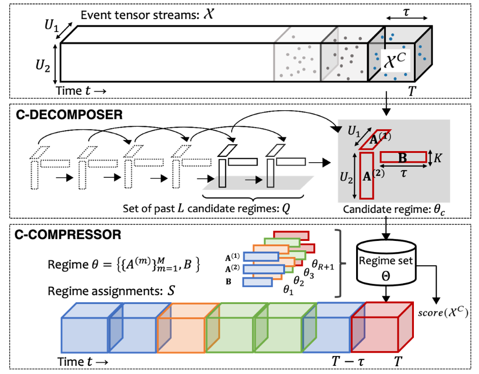
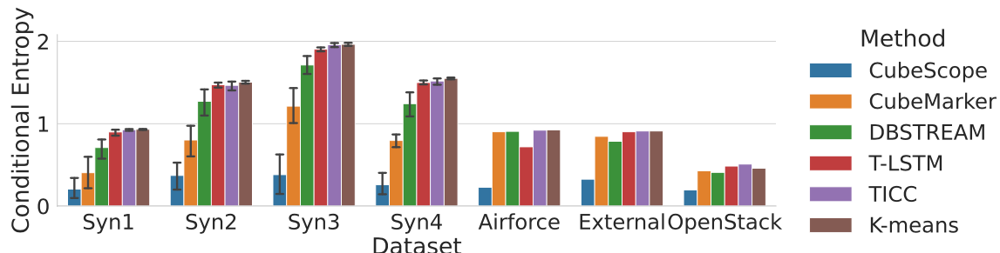

# CubeScope

Implementation of [CubeScope](),
Kota Nakamura, Yasuko Matsubara, Koki Kawabata, Yuhei Umeda, Yuichiro Wada, Yasushi Sakurai.
The Web Conference 2023, [WWW'23](https://www2023.thewebconf.org/).

 CubeScope is freely available for non-commercial purposes. 
 If you intend to use CubeScope for a commercial purpose, please contact us by email at [kota88@sanken.osaka-u.ac.jp]

## Quick demo
    # Quick demo: Temporal clustering
    # (Please see Section 5.2 "Q2 Accuracy" in this paper)  
    $ sh demo.sh

## Input for CubeScope
------------
Pandas.DataFrame  
Time + Multiple categorical attributes  

0| Time | Attribute1 | Attribute2 | Attribute3 | Attribute4 | ...  
1|                                :  
2|                                :  
3|                                :  

## Citation
If you use this code for your research, please consider citing our WWW paper.

