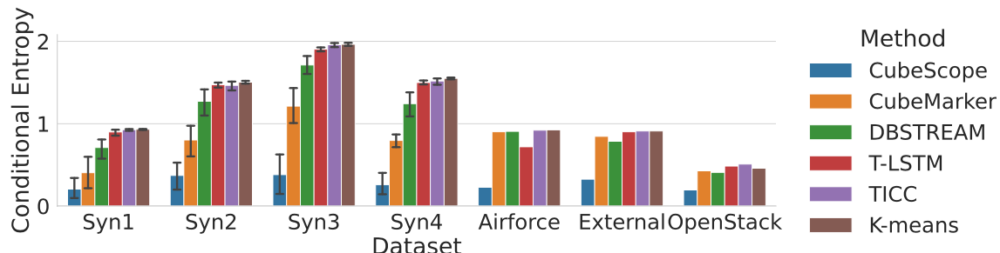

# CubeScope

Implementation of [CubeScope](),
Kota Nakamura, Yasuko Matsubara, Koki Kawabata, Yuhei Umeda, Yuichiro Wada, Yasushi Sakurai.
The Web Conference 2023, [WWW'23](https://www2023.thewebconf.org/).


 CubeScope is freely available for non-commercial purposes. 
 If you intend to use CubeScope for a commercial purpose, please contact us by email at [kota88@sanken.osaka-u.ac.jp]


## Quick demo
    # Quick demo: Temporal clustering
    # (Please see Section 5.2 "Q2 Accuracy" in this paper)  
    $ sh demo.sh



## Input for CubeScope
Pandas.DataFrame  
Time + Multiple categorical attributes  

0| Time | Attribute1 | Attribute2 | Attribute3 | Attribute4 | ...  
1|                                :  
2|                                :  
3|                                :  

## Datasets
1. *NYC-Taxi*  
https://www1.nyc.gov/site/tlc/about/tlc-trip-record-data.page.
2. *Bike-Share*  
https://ride.citibikenyc.com/system-data.
3. *Jewerly*  
https://www.kaggle.com/mkechinov/ecommerce-purchase-history-from-jewelry-store.
4. *Electronics*  
https://www.kaggle.com/mkechinov/ecommerce-purchase-history-from-electronics-store.
5. *AirForce*  
http://kdd.ics.uci.edu/databases/kddcup99/kddcup99.html
6. *External*  
https://www.hs-coburg.de/forschung/forschungsprojekte-oeffentlich/informationstechnologie/cidds-coburg-intrusion-detection-data-sets.html
7. *OpenStack*  
[ditto](https://www.hs-coburg.de/forschung/forschungsprojekte-oeffentlich/informationstechnologie/cidds-coburg-intrusion-detection-data-sets.html) 
8. *Kyoto*  
https://www.takakura.com/Kyoto_data/

## Citation
If you use this code for your research, please consider citing our WWW paper.
```bibtex
@inproceedings{nakamura2023cubescope,
  title={Fast and Multi-aspect Mining of Complex Time-stamped Event Streams},
  author={Nakamura, Kota and Matsubara, Yasuko and Kawabata, Koki and Umeda, Yuhei and Wada, Yuichiro and Sakurai, Yasushi},
  booktitle={Proceedings of the ACM Web Conference 2023},
  pages={1638--1649},
  year={2023}
}
```

## More on
* Paper: [[ACM DL]](https://dl.acm.org/doi/10.1145/3543507.3583370) [[arXiv]](https://arxiv.org/abs/2303.03789)
* Short Video: [[YouTube]](https://youtu.be/v-E-QjEBwNk)
